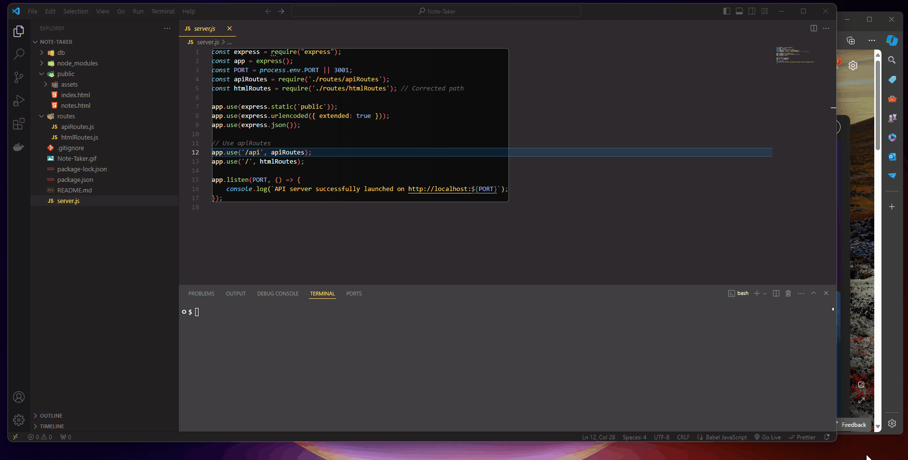

# Note Taker Application
Module 11 Challenge

## Table of Contents:
- [Description](#Description)
- [Acceptance Criteria](#Acceptance-Criteria)
- [Technologies](#Technologies)
- [Installation](#Installation)
- [Usage](#Usage)
- [Preview / Screenshot](#Preview-Screenshot)
- [Contact](#Contact)
- [References](#References)
- [License](#License)

## Description
This is a note-taking application designed for small business owners to organize their thoughts and keep track of tasks they need to complete.

## Acceptance Criteria

- When I open the Note Taker, I am presented with a landing page with a link to a notes page.
- When I click on the link to the notes page, I am presented with a page with existing notes listed in the left-hand column, plus empty fields to enter a new note title and the note’s text in the right-hand column.
- When I enter a new note title and the note’s text, a "Save Note" button and a "Clear Form" button appear in the navigation at the top of the page.
- When I click on the Save button, the new note I have entered is saved and appears in the left-hand column with the other existing notes, and the buttons in the navigation disappear.
- When I click on an existing note in the list in the left-hand column, that note appears in the right-hand column, and a "New Note" button appears in the navigation.
- When I click on the "New Note" button in the navigation at the top of the page, I am presented with empty fields to enter a new note title and the note’s text in the right-hand column, and the button disappears.

## Technologies
- HTML
- CSS
- JavaScript
- Node.js
- Express.js

## Installation
To install this application:
- Simply clone the repository
- run `npm install` & `npm init -y` to install the required dependencies.

## Usage
1. Open the application in your web browser.
2. Click on the generated link or use "http://localhost:3001" to access the notes page.
3. Start writing and saving notes as per the acceptance criteria mentioned above.

## Preview / Screenshot

## Contact
For more projects and information about the developer, please visit:
 - https://ajfizzle.github.io/Note-Taker
 - https://github.com/ajfizzle/Note-Taker

## References:
- UT Austin Bootcamp - UTA-VIRT-FSF-PT-02-2024-U-LOLC
- https://docs.npmjs.com/downloading-and-installing-node-js-and-npm
- https://www.npmjs.com/package/inquirer/v/8.2.4
- https://docs.npmjs.com/cli/v10/commands/npm-init
- https://getbootstrap.com/docs/5.0/components/buttons/

## License
This project is licensed under the MIT License - see the [LICENSE](LICENSE) file for details.